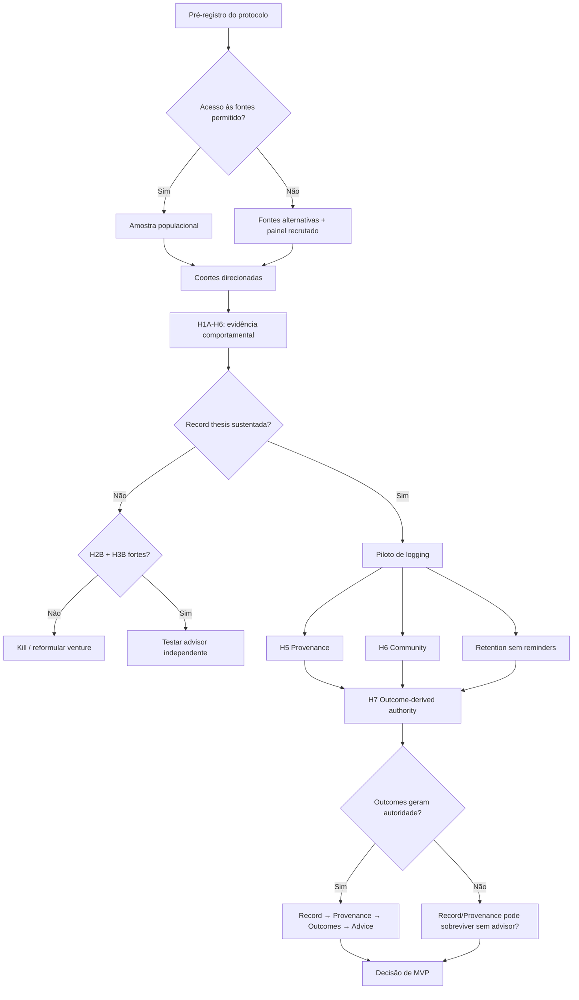
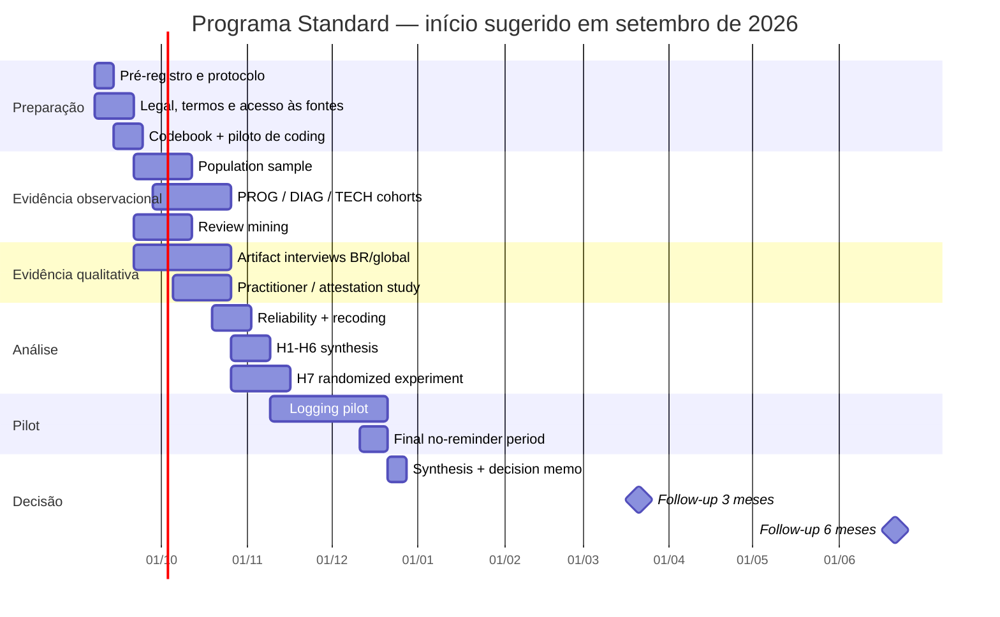

# Plano de pesquisa profunda para validação comportamental e de oportunidade de um produto de bonsai

## Resumo executivo

O `RESEARCH-BRIEF-behavioural-validation.md` tem uma espinha dorsal correta: observar comportamento existente antes de perguntar intenção, separar população de casos selecionados, preservar sazonalidade, acompanhar a mesma árvore ao longo do tempo e definir critérios de decisão antes de olhar os resultados. fileciteturn0file0 O `PROJECT-BRIEF.md` também acerta ao colocar **validação → piloto de logging → decisão de produto**, e não “pesquisa → build”. fileciteturn0file1

Depois da pesquisa atualizada, eu faria quatro mudanças fundamentais antes de executar o estudo.

**Primeiro: o estudo não pode mais tratar “registro longitudinal” como uma hipótese única.** Ele precisa separar comportamento público, comportamento privado e dor causada pela perda de histórico: H1A, H1B e H1C. Um grower pode nunca publicar uma progression e ainda possuir anos de fotos, notas e datas; o inverso também é possível.

**Segundo: provenance e comunidade precisam entrar formalmente.** A hipótese de Living Provenance ganhou relevância, mas também ganhou concorrência. Bonsai Tracker já oferece Tree ID permanente, transferência e página pública; Yoi Bonsai preserva o histórico quando a árvore troca de dono; Appy Bonsai também transfere árvores preservando fotos e histórico. Logo, **“histórico transferível” sozinho não é um wedge**. O território potencialmente interessante é provenance verificável: evidência, attestations, continuidade, custódia e credibilidade do histórico. citeturn18view0turn18view3turn12search2

Há, ao mesmo tempo, precedente institucional forte para a ideia: a Nippon Bonsai Association mantém desde 1980 um sistema de registro de *Kicho Bonsai* e afirma ter documentado 1.226 árvores, inclusive algumas posteriormente desaparecidas ou mortas. Isso demonstra que identidade, história e continuidade de uma árvore individual já possuem significado cultural dentro do bonsai; não demonstra, porém, demanda por um “pedigree universal” para árvores comuns. citeturn19view1

**Terceiro: a hipótese Brazil-first precisa ser testada, não assumida.** O projeto original parte da tese de que concorrentes são essencialmente norte-temperados. Hoje isso já não pode ser tratado como fato. Bonsai Tracker declara tarefas adaptadas a hemisfério, espécie e clima, enquanto Bonsai Empire diz otimizar cuidados usando espécie e clima local. Portanto, H4 deve testar **mismatch residual experimentado por growers brasileiros/tropicais**, e não tentar provar uma ausência competitiva que já deixou de ser evidente. citeturn18view0turn18view4

**Quarto: a estratégia de Reddit do brief está desatualizada.** Em junho de 2026, o Reddit passou a exigir aprovação explícita para acesso via API e a exigir aprovação escrita para uso comercial; o programa Reddit for Researchers é destinado a pesquisa acadêmica não comercial, com vínculo universitário e revisão ética. Por inferência, uma pesquisa de oportunidade para uma venture comercial não deve presumir elegibilidade ao RFR nem assumir que “free API + PRAW” está disponível. citeturn17view0turn17view1turn17view2

Minha recomendação é executar um **programa mixed-method de aproximadamente 12–14 semanas na configuração padrão**, seguido de checkpoints de três e seis meses. A versão recomendada combina:

| Componente | Configuração padrão recomendada | O que resolve |
|---|---:|---|
| Amostra populacional de conteúdo | ~800 unidades | H2A/H2B, distribuição das categorias e parte de H4 |
| Coorte longitudinal `PROG` | ~200 growers/árvores elegíveis | H1A e parte de H6 |
| Coorte `DIAG` | ~200 threads | H3A |
| Coorte `TECH` | ~200 threads | H3B |
| Screening comportamental | ~250–400 growers | H1B e segmentação |
| Artifact interviews | ~32 | H1B/H1C/H4/H5/H6 |
| Practitioners | ~10 | H5 attestations + validação de H7 |
| Review mining | ~400 reviews disponíveis | Fricção e gaps dos concorrentes |
| Experimento H7 | ~320 participantes | Outcomes vs reputação |
| Logging pilot | ~40 growers, 6 semanas | Fricção, aderência e early retention |
| Follow-up | 3 e 6 meses | Continuidade real após o piloto |

Os números acima são **parâmetros de planejamento, não constantes científicas**. Em qualitativo, o tamanho necessário depende da especificidade da amostra, qualidade das entrevistas, objetivo e estratégia analítica; estudos metodológicos distinguem inclusive *code saturation* de *meaning saturation*, esta última podendo exigir substancialmente mais entrevistas. citeturn13search4turn13search0

O resultado final não deve ser “qual produto parece legal”. Deve ser uma árvore de decisões:

**Record behavior existe? → Provenance adiciona motivação? → Community melhora pertencimento/retention? → Outcome evidence consegue gerar confiança? → Existe um wedge brasileiro real? → Só então escolher o produto.**

A conclusão estratégica mais importante é: **a pesquisa deve tentar descobrir se há um sistema coerente, não validar independentemente uma coleção de features.** A hipótese mais interessante agora é:

> **árvore com identidade persistente → registro longitudinal → provenance verificável → relações sociais em torno da jornada → outcomes agregados → autoridade baseada em evidência.**

Cada seta precisa ser testada. A ausência de uma delas pode mudar completamente o produto.

## Objetivos e hipóteses falsificáveis

O objetivo primário é descobrir se existe base comportamental suficiente para um **system of record por árvore** que possa evoluir para provenance, network e decision support. O objetivo secundário é descobrir se algum componente — particularmente advisor — continua viável caso a tese de record falhe.

As hipóteses abaixo devem ser registradas **antes da coleta principal**, com métricas, exclusões e thresholds congelados. Um registro timestamped evita que um resultado marginal seja reinterpretado depois de conhecido; serviços de preregistration como OSF existem justamente para registrar questões, métodos e planos de análise antes da análise. Um registro pode inclusive ficar sob embargo quando há preocupação comercial. citeturn15search1turn15search4turn15search6

| Hipótese | Formulação falsificável | Métrica primária | Threshold proposto |
|---|---|---|---|
| **H1A · Public longitudinal documentation** | Growers retornam publicamente à mesma árvore ao longo do tempo | % de growers `PROG` que retornam à mesma árvore ≥183 dias depois | ≥25% forte; 10–24,9% misto; <10% falha |
| **H1B · Private longitudinal record** | Growers mantêm registros privados da árvore mesmo sem publicar | % de growers elegíveis que **mostram** artefato com histórico ≥6 meses | ≥25% forte; 10–24,9% misto; <10% falha |
| **H1C · Record continuity pain** | Perder histórico/datas causa problema concreto | % de artifact interviews com incidente passado específico antes de exposição ao conceito | ≥30% forte; 15–29% moderado; <15% fraco |
| **H2A · Reactive diagnostic anxiety** | “O que há de errado/minha árvore está morrendo?” é recorrente | `DIAG + POSTMORTEM` / atividade elegível | ≥25% forte; 15–24,9% moderado; <15% fraco |
| **H2B · Prospective decision anxiety** | “É seguro fazer X agora?” é recorrente | TECH explicitamente go/no-go/timing / atividade | ≥10% forte; 5–9,9% moderado; <5% fraco |
| **H3A · Diagnostic contradiction** | Diagnósticos recebem recomendações materialmente incompatíveis | % `DIAG` com ≥3 respostas substantivas e conflito | ≥30% forte; 15–29,9% moderado; <15% falha |
| **H3B · Action/timing contradiction** | Recomendações de ação/timing são materialmente incompatíveis | % `TECH` elegível com conflito | ≥30% forte; 15–29,9% moderado; <15% falha |
| **H4 · Brazil/tropical mismatch** | Growers brasileiros/tropicais experimentam mismatch climático/sazonal concreto | Triangulação conteúdo + entrevistas + audit de concorrentes | Wedge apenas se ≥2 métodos independentes sustentarem problema material |
| **H5 · Living Provenance** | Histórico da árvore tem valor além de diário pessoal e recebe confiança quando verificável | comportamento existente + export/share + attestation | Forte se ≥2 de 3 critérios abaixo passarem |
| **H6 · Tree-Led Community** | Interação recorrente forma-se ao redor de árvores/jornadas relevantes, não apenas generic social feed | repeat interaction + comportamento no microteste | Forte se repeat interaction e participação voluntária aparecerem |
| **H7 · Outcome-derived authority** | Evidência agregada de outcomes pode substituir ou reduzir dependência de reputação individual | experimento randomizado de confiança/ação | Strong substitute se outcomes forem não inferiores ao especialista na métrica primária |

Esses thresholds de produto **não são leis estatísticas**. São critérios econômicos propostos que precisam ser congelados antes da análise.

**H1A** preserva a melhor parte do brief original, mas muda a interpretação. O comportamento público é evidência de documentação pública, não de todo record-keeping. Bonsai Nut prova que progressions muito longas existem — há uma thread explicitamente criada para mostrar progressões de 5–10+ anos a iniciantes, incluindo exemplos de 16 anos — mas isso demonstra existência, não prevalência. citeturn21search1

**H1B** exige evidência, não resposta de survey. “Sim, eu registro minhas árvores” não conta. A pessoa precisa mostrar algo preexistente: camera roll organizado, planilha, notebook, etiquetas, calendário, app, fórum, álbum, etc. A técnica de artifact interviewing é útil precisamente porque artefatos ajudam participantes a externalizar conhecimento e práticas implícitas que entrevistas abstratas podem não revelar. citeturn13search4

Para H1B, eu classificaria como record longitudinal forte um artefato que contenha **a mesma árvore, pelo menos três entradas datadas e uma amplitude ≥183 dias**. Fotos perdidas no camera roll podem contar como “historical evidence”, mas não necessariamente como “intentional record”; essa distinção deve ser codificada.

**H1C** não pergunta “você gostaria de ter um histórico?”. Pergunta se já ocorreu algo como:

> “Não sei quando replantei.”

> “Perdi as fotos antigas.”

> “Não faço ideia de onde essa árvore veio.”

> “Quando comprei não anotei a espécie.”

> “Queria mostrar a evolução mas não tenho o antes.”

Um incidente passado e concreto vale muito mais do que interesse declarado.

**H2A e H2B** devem permanecer separados porque representam produtos diferentes. H2A é diagnóstico reativo; H2B é contraindicação prospectiva. Para o `go/no-go advisor` descrito no projeto, **H2B é a hipótese mais load-bearing**.

**H3A e H3B** também precisam ser separados. “É fungo ou excesso de água?” é uma contradição diagnóstica. “Replante agora” versus “não toque até a próxima estação” é uma contradição de ação. Para cada conflito, o estudo deve codificar ainda a provável fonte:

`missing context` · `species` · `climate` · `season` · `tree stage` · `genuine expert disagreement` · `not actually contradictory`.

**H4 muda de natureza.** O projeto deve testar o quanto localização brasileira/tropical ainda gera decisões inadequadamente calibradas. Isso é particularmente necessário porque dois concorrentes atuais já afirmam adaptação climática: Bonsai Tracker anuncia tarefas sensíveis a hemisfério/clima e Bonsai Empire declara tips baseados no clima local. citeturn18view0turn18view4

H4 deveria passar somente se houver triangulação. Exemplo:

- ≥20% das ocorrências brasileiras/tropicais elegíveis mostram mismatch concreto de timing/contexto;
- ≥30% dos artifact interviews brasileiros relatam um incidente real;
- um audit cego de outputs de apps atuais por practitioner brasileiro encontra gaps materialmente relevantes.

Um único desses sinais não basta para declarar “Brazil wedge”.

**H5 — Living Provenance** deve testar quatro coisas separadas: valor da história, transferência, evidência e attestation. O ponto de comparação mudou. Bonsai Tracker já possui Tree ID permanente e transferência; Yoi preserva “lineage” e histórico; Appy Bonsai preserva histórico/fotos na transferência. Portanto, um produto novo só ganha território se fizer algo mais forte — por exemplo, **cadeia de evidência, nível de confiança e attestations por terceiros**. citeturn18view0turn18view3turn12search2

Eu definiria os três gates de H5 assim:

| Gate de H5 | Evidência forte proposta |
|---|---|
| **Existing provenance behavior** | ≥25% de uma coorte direcionada de transfer/sale/progression possui ≥2 elementos de provenance além de espécie/foto |
| **User value behavior** | ≥40% dos participantes do piloto voluntariamente geram/exportam/compartilham o “tree record” ao final |
| **Attestation feasibility** | ≥50% dos practitioners convidados conseguem completar uma attestation real de um evento conhecido com baixo atrito |

H5 passa forte se pelo menos dois dos três ocorrerem e nenhum revelar objeção crítica de confiança.

A attestation deveria distinguir:

`self-recorded` → `counterparty-confirmed` → `practitioner-verified` → `institution-verified`.

Isso preserva honestidade epistemológica. O sistema não diz “é verdade”; ele diz **quem afirmou, qual evidência existe e quem confirmou**.

O precedente japonês torna a tese plausível: o sistema *Kicho Bonsai* registra árvores consideradas relevantes por forma, valor acadêmico/histórico e tradição, com finalidade explícita de preservação e transmissão; seu acervo histórico continua documentando até árvores perdidas ou mortas. citeturn19view1

**H6 — Tree-Led Community** não deve testar “as pessoas gostam de comunidades?”. Isso já seria quase tautológico. Bonsai Empire tem social feed, Bonsai Tracker possui community/DM/forum, Jooni combina journal e gallery, e Tiny Tree Club estrutura tracking + feed + marketplace ao redor de clubes. citeturn18view0turn18view4turn20search0turn19view0

A hipótese diferencial é:

> Growers formam relações recorrentes em torno da **jornada relevante de uma árvore** — mesma espécie, clima, estágio, problema, origem ou desafio — e isso gera utilidade/pertencimento sem depender de rankings de popularidade.

As métricas principais de H6 não devem ser likes. Devem ser:

**repeat non-owner interaction**, pedido espontâneo de update, ajuda oferecida, retorno à mesma jornada, resposta a falha/morte e participação em pequenos grupos correspondentes por contexto.

**H7 — Outcome-derived authority** é a hipótese mais importante para o moat e atualmente a menos provada. O `PROJECT-BRIEF` argumenta que outcomes em escala poderiam substituir reputação. fileciteturn0file1 Isso precisa de experimento próprio.

Eu usaria quatro condições randomizadas para o mesmo cenário:

| Condição | Exemplo conceitual |
|---|---|
| A | “Um practitioner reconhecido recomenda X” |
| B | “Dados de N árvores comparáveis mostram outcome X” |
| C | “Practitioner recomenda X + dados sustentam X” |
| D | “Consenso genérico da comunidade recomenda X” |

Os dados de outcome utilizados nessa fase devem ser claramente rotulados como **cenário experimental/simulado**, para não fabricar evidência horticultural.

Primary endpoint: confiança em agir, escala de 1–7.

Secondary endpoints: escolha de ação, necessidade de buscar segunda opinião, percepção de credibilidade e confiança quando os dados contradizem o especialista.

A conclusão de H7 precisa distinguir três mundos:

- **Substitute:** aggregate outcomes ≈ especialista.
- **Complement:** especialista + outcomes > ambos isoladamente.
- **Fail:** outcomes não superam o déficit reputacional.

Como regra proposta de não inferioridade, a condição B poderia ser considerada substituta caso o intervalo de confiança da diferença em relação à A permaneça acima de **−0,5 ponto em escala de 7**, margem que deve ser congelada antes da coleta. Caso C vença A mas B fique claramente abaixo, a conclusão não é “data replaces reputation”; é **“data augments reputation”**.

## Desenho de pesquisa e amostragem

A arquitetura metodológica recomendada tem **quatro camadas de evidência**:

**observed public behavior → demonstrated private behavior → controlled behavioral test → pilot behavior.**

Nenhuma fonte resolve todas as hipóteses.

| Método | Bom para | Ruim para |
|---|---|---|
| Amostra populacional pública | prevalência de categorias, H2, parte de H4 | comportamento privado, causalidade |
| Coorte direcionada | H1A, H3, H5/H6 raros | estimar prevalência de mercado |
| Artifact interview | H1B/H1C/H4/H5 | prevalência populacional precisa |
| Product-review mining | fricções e competitor gaps | prevalence / PMF |
| Experimento H7 | causalidade de framing/autoridade | comportamento longitudinal |
| Logging pilot | aderência real e friction | provar retenção de anos |

**Amostra populacional versus coortes direcionadas**

A distinção precisa ser inviolável.

A amostra populacional responde:

> “Que proporção da atividade tem determinado comportamento?”

A coorte direcionada responde:

> “Dentro de pessoas que já fazem X, o que acontece depois?”

Nunca se deve pesquisar `progression` e usar o resultado para afirmar que progression é prevalente.

Na configuração padrão eu usaria aproximadamente:

**Population frame:** 800 unidades.

**PROG targeted cohort:** 200 growers elegíveis.

**DIAG:** 200 threads com ≥3 respostas substantivas.

**TECH:** 200 threads com ≥3 respostas substantivas.

As coortes podem compartilhar algumas unidades com a population sample, mas suas estimativas internas precisam ser identificadas como **conditional estimates**.

O mínimo original de 400 é razoável para estimar uma proporção populacional em ordem de grandeza, mas fraco para um subgrupo raro. Por exemplo, com 100 observações e proporção observada de 25%, um Wilson 95% CI fica aproximadamente em 17,5%–34,3%; com 400, fica aproximadamente em 21,0%–29,5%. Intervalos de Wilson têm comportamento de cobertura melhor do que o intervalo normal de Wald, especialmente com amostras menores. citeturn13search3

Isso justifica **population sample + enrichment**, não simplesmente inflar uma única amostra indiscriminadamente.

**As janelas temporais devem ser diferentes.**

Para prevalence/H2/H3:

**1 set. 2025 → 31 ago. 2026**

pode ser a janela-base atual de 12 meses.

Para H1A, é preciso evitar right-censoring. Se um post inicial é de julho de 2026, ele ainda não teve seis meses de oportunidade para gerar um repeat.

Portanto:

**index cohort H1A: 1 mar. 2025 → 28 fev. 2026**

**follow-up disponível até: 31 ago. 2026**

Assim cada index post teve pelo menos aproximadamente seis meses para retornar.

Em análise longitudinal, right-censoring ocorre quando o evento ainda pode acontecer depois do período observado; tratar esses casos como “não retornou” enviesaria artificialmente a taxa para baixo. citeturn4search17

Regra operacional:

> uma unidade só entra no denominator de “repeat ≥6 months” se teve ≥183 dias completos de observação possível.

Conta deletada/inacessível não vira automaticamente `NO RETURN`; vira `UNOBSERVABLE`.

A análise primária de H1A deve ser **user-level**, porque a hipótese fala sobre growers. Eu faria:

**Primary:** um index-tree elegível por grower, selecionado aleatoriamente quando houver vários.

**Secondary:** todos os pares `user × tree`, com incerteza ajustada por cluster do usuário.

Isso produz três números diferentes:

`PROG posts / all posts`

`unique PROG growers / unique growers`

`same-tree repeat growers / eligible PROG growers`

O terceiro é o principal.

**Same-tree matching** não pode depender de similaridade visual da IA sozinha. O match deve usar evidência:

nome/ID dado pelo autor  
referência explícita ao post anterior  
espécie + características + texto  
links do autor  
sequência fotográfica consistente

Casos incertos recebem `UNCERTAIN`, são double-coded e não devem ser forçados para sim/não.

**Artifact interviews**

Eu usaria entrevistas de 45–60 minutos, em português ou idioma nativo do participante. A entrevista começa sem mostrar o conceito do produto.

Roteiro sugerido:

| Momento | Prompt |
|---|---|
| História | “Escolha uma árvore que importa para você e me conte desde quando ela chegou.” |
| Artifact reveal | “Mostre como você descobriria o que já fez nela.” |
| Memory test | “Quando foi o último replante? Como você sabe?” |
| Timeline | “Consegue me mostrar como ela era há seis meses/um ano?” |
| Loss | “Já precisou de uma informação sobre uma árvore e não conseguiu encontrar?” |
| Decision | “Mostre um caso em que você ficou em dúvida antes de fazer alguma técnica.” |
| Conflict | “Quando recebe duas respostas diferentes, como decide em qual confiar?” |
| Provenance | “Imagine que vai entregar essa árvore a outra pessoa amanhã. O que você mandaria junto?” |
| Attestation | “Que parte desse histórico você consideraria confiável? O que precisaria de confirmação?” |
| Community | “Mostre onde você conversa sobre suas árvores. O que faz você postar ou não postar?” |
| Failure | “Existe uma árvore que morreu ou regrediu? Você documentou o que aconteceu?” |
| Somente no fim | Mostrar conceitos de record/provenance/community e colher reação |

O researcher não pergunta primeiro:

> “Você gostaria de um pedigree digital?”

Isso cria demanda artificial.

Ele pergunta:

> “Entregue essa árvore a outra pessoa.”

E observa o que o grower espontaneamente considera necessário preservar.

O formulário de artifact collection deve conter:

| Campo | Exemplo |
|---|---|
| Participant ID | `BR-BEG-017` |
| Tree pseudo-ID | `T03` |
| Experience | first tree / second / expanding / advanced |
| Artifact type | photos / notes / spreadsheet / app / tags / forum |
| First dated evidence | YYYY-MM-DD |
| Last dated evidence | YYYY-MM-DD |
| Number of dated entries | integer |
| Species recorded? | yes/no/uncertain |
| Acquisition source/date | yes/no |
| Interventions | types + dates |
| Photos | count/range, não arquivos por default |
| Previous owner | yes/no |
| Practitioner involvement | yes/no |
| Exhibition/club evidence | yes/no |
| Death/failure recorded | yes/no |
| Reminder mechanism | none/calendar/app/etc. |
| Can participant retrieve last repot? | yes/no + time |
| Missing information incident | short coded note |
| Would hand history to next owner? | actual task result |
| Artifact retained by research? | metadata only / redacted image / none |
| Consent scope | internal / quote / image / future contact |

Por padrão, **coletar metadados sobre o artefato é melhor que copiar o artefato inteiro**.

**Brazil/tropical stratum**

O Brasil deve ser uma amostra própria, não uma inferência a partir de Reddit.

O stratum padrão deveria ter pelo menos:

- 60% dos artifact interviews no Brasil;
- diversidade entre Sul/Sudeste e regiões mais tropicais;
- first/second-tree owners como maioria;
- uma pequena fração de experienced growers para comparar comportamento;
- practitioners brasileiros separados da amostra consumer.

Há canais atuais de recrutamento em português fora de redes sociais genéricas. A Prefeitura de São Paulo mantém uma oficina de bonsai em 2026, e a FELAB opera como federação latino-americana/caribenha, oferecendo canais para chegar a practitioners e organizações regionais. Hotmart também continua exibindo produtos educacionais de bonsai em português, útil como indício comercial e fonte de recrutamento — não como evidência neutra de prevalência. citeturn19view4turn19view5turn19view3

**Reddit e alternativas de acesso**

A seção do brief que assume “API oficial gratuita + PRAW” deve ser removida. O Reddit exige hoje aprovação para acesso e exige aprovação escrita/contrato para casos comerciais; a política proíbe circumvention de limites. O RFR é destinado a pesquisa acadêmica patrocinada por instituição, não comercial. citeturn17view0turn17view1turn17view2

Portanto:

1. solicitar formalmente ao Reddit enquadramento/aprovação comercial para o projeto;
2. não começar bulk collection antes da resposta;
3. não usar Pushshift, scrapers ou múltiplas contas para contornar restrições;
4. não enviar conteúdo bruto do Reddit para modelos externos de IA sem que a autorização/contrato permita explicitamente esse processamento;
5. ter um design de estudo que sobreviva sem Reddit.

Se o acesso não vier, o fallback não é “scrape anyway”.

É:

**Bonsai Nut + painéis próprios + artifact interviews + apps/reviews + comunidades com autorização + clubes/eventos + websites públicos cujo acesso automatizado seja explicitamente permitido.**

Search-engine results podem ajudar a formar **coortes direcionadas**, mas não um denominator de prevalência, pois não representam uma amostra completa.

Bonsai Nut é particularmente valioso para H1/H6 porque progressions longas existem de forma explícita e são usadas para ensinar outros growers; esse comportamento é exatamente o tipo de ocorrência a ser quantificada, e não simplesmente citada como anedota. citeturn21search1turn21search2

**Product-review mining**

Reviews devem ser uma fonte complementar.

Amostragem padrão: aproximadamente 400 reviews quando disponíveis, estratificados por:

produto  
store  
versão  
data  
rating

Codebook de review:

`setup friction`  
`logging friction`  
`photo management`  
`reminders`  
`missing history`  
`transfer/provenance`  
`community quality`  
`trust/advice`  
`climate`  
`pricing/paywall`  
`bugs/performance`  
`export/data ownership`  
`abandonment reason`

Reviews antigas não devem ser tratadas como verdade sobre a versão atual. Jooni, por exemplo, possui reviews antigas mencionando problemas de upload/bugs, mas a App Store mostra uma versão 2.0.0 recente; a informação útil é “essa fricção já ocorreu”, não “esse bug existe hoje”. citeturn20search0

**Logging pilot**

O piloto não deve ser um app completo. O objetivo é testar o comportamento, não a beleza da UI.

Uma implementação suficiente:

`Tree ID → foto → evento → data → nota opcional → 30–60 segundos`

Pode ser feita com formulário mobile + timeline automatizada, evitando semanas de engenharia.

Design padrão:

**n≈40, seis semanas**, ≥60% first/second-tree owners.

Semana inicial: onboarding e registro de 1–3 árvores.

Semanas seguintes: logging de eventos reais.

Para separar comportamento espontâneo de comportamento induzido, randomizar:

**20 low-reminder**

**20 no-reminder**

No final, retirar reminders de todos por 7–10 dias e medir logging espontâneo.

Primary pilot metrics:

`tree creation completion`

`time-to-first-log`

`weekly active logger`

`logs per tree-week`

`% spontaneous logs`

`photo attachment rate`

`week-4/week-6 retention`

`retrieval success: "quando replantei?"`

`voluntary provenance export`

`share/transfer behavior`

`logging after reminder withdrawal`

Um piloto de seis semanas **não valida retenção de anos**. Ele valida atrito e early habit. É obrigatório um follow-up em três e seis meses para saber se o comportamento continua.

Para H6, eu não contaminaria todo o logging pilot imediatamente com comunidade. Primeiro deve existir um baseline privado. Depois, na configuração média/alta, pode-se abrir um microteste de **Tree Circles**:

mesma espécie + clima  
mesma técnica  
first-tree  
recovery  
same development stage

e medir mensagens substantivas e retorno, não likes.

## Medição e regras de decisão

O estudo precisa separar **measurement**, **uncertainty** e **decision**.

A recomendação para proporções é reportar sempre:

`numerator / denominator`

`point estimate`

`Wilson 95% CI`

`weighted estimate`, quando aplicável

`source/stratum`

O intervalo de Wilson é preferível ao Wald ingênuo porque este pode apresentar cobertura ruim, especialmente em amostras menores ou proporções afastadas de 50%. citeturn13search3

**Regra para thresholds e intervalos**

Não considero adequado transformar:

24,9% = “não”  
25,0% = “sim”

sem olhar incerteza.

Eu usaria duas camadas:

**Decision zone:** determinada pelo point estimate pré-registrado.

**Evidence confidence:** determinada pelo CI.

| Situação | Interpretação |
|---|---|
| CI inteiro dentro da mesma zona | **Confirmed** |
| CI cruza um cutoff adjacente | **Boundary** |
| CI cruza Strong e Fail | **Inconclusive / underpowered** |
| CI inteiro dentro da Fail zone | **Confirmed fail** |

Um `Boundary Strong` não vai para build. Ele justifica expandir apenas a coorte necessária até atingir a precisão pré-definida ou o cap de amostra.

**Sazonalidade**

A estratificação por mês do brief é correta, mas existem duas estimativas possíveis.

Se cada mês recebe o mesmo `n`, a média simples estima:

> comportamento em um **mês típico**.

Para estimar:

> comportamento ao longo da **atividade anual real**,

é preciso ponderar cada mês pela participação real daquele mês no volume anual.

Portanto, reportar:

**month-standardized estimate**

e

**activity-weighted annual estimate**.

Nunca esconder a diferença.

Recurring beginner threads também devem formar um frame separado de standalone posts. Caso contrário, H2 pode ficar artificialmente baixo se diagnósticos estiverem concentrados dentro dessas megathreads. Essa possibilidade já é reconhecida pelo research brief anexado. fileciteturn0file0

**Intercoder reliability**

IA pode fazer primeira passagem. Ela não pode ser o único juiz de categorias que determinam a tese.

Os códigos que obrigatoriamente precisam de dupla classificação humana em uma amostra independente incluem:

`PROG vs SHOW`

`same tree`

`beginner`

`material conflict`

`species-specific`

`climate-specific`

`provenance element`

`attestation strength`

`meaningful social interaction`

Recomendo double-code inicial de 50–100 unidades para calibração e, depois, **20% de cada coorte crítica**.

Krippendorff's alpha é apropriado para medir confiabilidade de coding e foi desenvolvido justamente para lidar com problemas de reliability em content analysis; a literatura de Krippendorff enfatiza que simples aparência de concordância pode enganar. citeturn14search0

Regra operacional:

**α ≥ 0,80:** liberar inferência firme.

**0,667 ≤ α < 0,80:** conclusão apenas provisória; revisar codebook.

**α < 0,667:** não analisar aquela variável; recodificar.

Esses pontos são convenções, não leis naturais; a própria tradição associada a Krippendorff trata ≥0,80 como confiável e a faixa 0,667–0,80 como adequada apenas para conclusões tentativas. citeturn22search0

O alpha deve ser calculado por **variável**, não apenas “alpha do dataset”. É perfeitamente possível `primary_category` ter α=.93 e `material_conflict` ter α=.58.

**Outline do codebook ampliado**

O codebook atual deve ser preservado:

`PROG` · `SHOW` · `DIAG` · `POSTMORTEM` · `TECH` · `ID` · `ACQUIRE` · `RESOURCE` · `SOCIAL` · `OTHER`. fileciteturn0file0

Eu adicionaria flags:

| Grupo | Flags |
|---|---|
| Target | `FIRST_TREE`, `SECOND_TREE`, `EXPANDING`, `EXPERIENCED`, `UNKNOWN` |
| Tree identity | `SAME_TREE_CONFIRMED`, `PROBABLE`, `UNCERTAIN`, `DIFFERENT` |
| Decision | `GO_NO_GO`, `TIMING`, `HOW_TO`, `DIAGNOSIS` |
| Context | `SPECIES_PRESENT`, `CLIMATE_PRESENT`, `LOCATION_PRESENT`, `STAGE_PRESENT` |
| Advice | `SPECIES_CALIBRATED`, `CLIMATE_CALIBRATED`, `GENERIC` |
| Conflict | `DIAG_CONFLICT`, `ACTION_CONFLICT`, `TIMING_CONFLICT`, `NO_CONFLICT` |
| Provenance | `ACQUISITION`, `OWNER_HISTORY`, `PRACTITIONER`, `EXHIBITION`, `TRANSFER`, `EVIDENCE` |
| Community | `UPDATE_REQUEST`, `RETURNING_COMMENTER`, `MENTORING`, `FAILURE_SUPPORT`, `STATUS_SIGNAL` |
| Outcome | `ALIVE`, `IMPROVED`, `DECLINED`, `DEAD`, `UNKNOWN` |
| Missing | sempre `UNKNOWN`, nunca inferência silenciosa |

`Unknown` é informação.

“Não informou localização” não significa Estados Unidos.

**Regras de decisão combinadas**

O erro mais importante do brief atual é fazer H1A sozinho matar Idea A. Eu mudaria isso.

| Evidência | Ação |
|---|---|
| **H1A forte OU H1B forte** | avançar para logging pilot |
| ambos mistos + H1C forte | pilotar de forma estreita |
| H1A falha, H1B forte | thesis privada continua viva; fórum não era proxy adequado |
| H1A + H1B falham | system-of-record thesis falha |
| H2A forte, H2B fraco | oportunidade é diagnóstico, não go/no-go |
| H2B + H3B fortes | advisor merece teste, condicionado a H7 |
| H3 fraco | não vender “adjudication” como wedge |
| H4 forte em ≥2 métodos | Brazil/tropical pode ser wedge |
| H4 fraco | PT-BR pode continuar como mercado, mas não como diferenciação climática |
| H5 forte | provenance entra no núcleo |
| H5 fraco | manter histórico como utility, não como estratégia |
| H6 forte | testar community layer |
| H6 fraco | não construir social network |
| H7 substitute | outcome-data pode ser fonte independente de autoridade |
| H7 complement | buscar practitioner + data model |
| H7 fail | outcome moat não resolve credibility problem |

A principal mudança de governance é:

> **nenhum resultado desta pesquisa significa “Proceed to build”.**

Resultado forte significa:

> **Proceed to the next falsification gate.**

Isso preserva a disciplina definida originalmente no próprio Project Brief. fileciteturn0file1

## Recrutamento, concorrentes e priorização de fontes

A amostra deve ser **Brazil-first, não Brazil-only**.

Eu recomendaria:

**consumer qualitative:** ~60–65% Brasil, ~35–40% global.

**content analysis:** reportar fontes separadamente; nunca fingir que Reddit/Bonsai Nut representam o mercado brasileiro.

**first/second-tree owners:** pelo menos 60% da amostra consumer.

**experienced growers:** presentes como contraste, não dominantes.

**practitioners:** uma coorte própria.

O princípio é importante: se experts forem metade da amostra, podemos validar um produto excelente para exatamente o público que o projeto decidiu não priorizar.

**Estratégia de recrutamento no Brasil**

Prioridade:

1. workshops e clubes;
2. canais de professores;
3. eventos/organizações latino-americanas;
4. estudantes de cursos;
5. social media;
6. anúncios pagos apenas para preencher quotas faltantes.

A Prefeitura de São Paulo mantém atividades públicas de bonsai, o que oferece um canal particularmente útil para encontrar iniciantes sem selecionar apenas heavy online users. A FELAB fornece uma ponte para practitioners e associações latino-americanas. citeturn19view4turn19view5

O convite deve evitar:

> “Estamos criando o novo app de bonsai.”

Usar algo como:

> “Estamos estudando como pessoas cuidam, registram decisões e aprendem sobre suas árvores. Procuramos pessoas com primeira/segunda árvore e hobbyistas para uma pesquisa de comportamento.”

Isso reduz self-selection por entusiasmo com apps.

**Practitioner outreach para H5/H7**

A meta padrão seria ~10 practitioners, com diversidade de clima e tradição.

Cada um recebe três tarefas:

**Attestation task:** confirmar um evento real que ele efetivamente realizou/observou.

**Provenance credibility sort:** ordenar por confiança: self-entry, dated photo, receipt, prior owner confirmation, practitioner signature, exhibition catalog, club record.

**H7 validation:** revisar os cenários experimentais para garantir que nenhuma condição pareça absurda ou trivialmente correta.

A pergunta decisiva de H5 é:

> “Você colocaria seu nome ao lado desta afirmação específica sobre esta árvore?”

Isso vale mais que:

> “Você acha um certificado uma ideia interessante?”

**O landscape competitivo muda o que deve ser validado**

| Player | Já possui | Implicação |
|---|---|---|
| **Bonsai Tracker** | photo timeline, care log, tasks por espécie/clima/hemisfério, Tree ID permanente, transfer, AI por árvore, community, DM, forum | identidade + transfer + community **não são espaço vazio** citeturn18view0 |
| **Yoi Bonsai** | logging, histórico completo, transfer, lineage, student/teacher sharing, marketplace | sobreposição forte com H5 e P3 citeturn18view3 |
| **Bonsai Empire** | tracking, reminders, local climate, species guidance, social feed, autoridade editorial | H4 não pode assumir falta de climate calibration; credibility continua diferencial citeturn18view4 |
| **Jooni** | journal de intervenções, timeline e community gallery | record + social já foram combinados citeturn20search0 |
| **Tiny Tree Club** | record, feed, mensagens e marketplace centrados em clubes verificados | precedente importante para community baseada em trusted group citeturn19view0 |
| **Bonsai Nut** | fórum com progressions de muitos anos e discussão longitudinal | excelente fonte comportamental para H1/H6; não é structured record citeturn21search1 |
| **Appy Bonsai** | histórico, fotos e transferência preservando traceability; PT-BR disponível | concorrente adicional que deve entrar formalmente no brief citeturn12search2turn12search3 |

Há uma conclusão incômoda, mas valiosa:

**“Logging + transfer + social” já existe em várias formas.**

Logo, a nova pesquisa não deve perguntar apenas:

> “As pessoas querem isso?”

Ela precisa descobrir:

> **“Qual parte desse sistema continua não resolvida de maneira suficientemente valiosa?”**

As áreas ainda plausíveis são:

**verified provenance**

**attestations**

**beginner-safe tree-led community**

**outcome dataset**

**evidence-based authority**

**superior low-friction logging**

**eventual network effects entre tree identity + people + outcomes**

A diferenciação real pode estar na arquitetura do grafo, não na lista de features.

**Hierarquia de fontes**

Eu usaria esta ordem de confiança:

| Prioridade | Fonte | Uso |
|---|---|---|
| **A** | sites oficiais dos apps, App Store/Google Play oficial | features, pricing, current capabilities |
| **A** | associações, governo, legislação | provenance institucional, recrutamento, ética/legal |
| **A** | papers metodológicos originais | metodologia estatística/qualitativa |
| **B** | fóruns originais como Bonsai Nut | comportamento real |
| **B** | fontes brasileiras em português | linguagem, contexto, canais, recruitment |
| **C** | user reviews | pain/friction discovery |
| **C** | marketplaces de curso | sinais comerciais, nunca market-size proof |
| **D** | blogs/SEO/aggregators | discovery apenas; substituir pela fonte original sempre que possível |

Essa regra é especialmente importante para competitor research: uma comparação deve se basear no **produto atual**, não em uma review de três anos atrás.

## Governança e ética

Este estudo parece benigno — é sobre bonsai — mas ainda envolve pessoas, identidades persistentes, histórico público, usernames, localização e possivelmente dados relacionais.

Para participantes brasileiros, a pesquisa precisa ser desenhada com os princípios da LGPD de finalidade, adequação, necessidade/minimização, transparência, segurança, prevenção e responsabilização. citeturn16search0turn16search1

O princípio operacional deve ser:

> **colete o mínimo necessário para responder à hipótese.**

Não precisamos do nome real de alguém para saber se voltou à mesma árvore.

**Arquitetura de identidade**

Internamente:

`source_user_id → keyed pseudonymous ID`

Exemplo:

`reddit_user → HMAC(secret_key, source + original_id) → U_a19f...`

Eu prefiro HMAC com segredo armazenado separadamente a um hash simples, porque usernames são facilmente enumeráveis.

Mas isso continua sendo **pseudonimização**, não anonimização. A orientação pública brasileira diferencia dados efetivamente anonimizados daqueles que ainda podem ser associados a um indivíduo; se a identificação continuar razoavelmente possível, o dado segue sendo pessoal. citeturn16search6turn16search7

**Três camadas de dataset**

| Camada | Conteúdo | Acesso |
|---|---|---|
| **Raw restricted** | source IDs, URLs, texto necessário, consent forms | 1–2 responsáveis autorizados |
| **Analysis** | pseudonymous IDs, códigos, timestamps, derived variables | research team |
| **Shareable** | agregados + codebook + métricas sem identificadores | advisors/relatório |

Não compartilhar o raw dataset simplesmente porque o conteúdo original “era público”.

As diretrizes da Association of Internet Researchers tratam ética de internet como algo contextual ao longo de todo o ciclo da pesquisa, inclusive big data e IA; “publicly accessible” não elimina automaticamente preocupações de contexto e expectativa de privacidade. citeturn16search14

**Reddit tem regras adicionais.** O RFR, por exemplo, proíbe redistribuição de dados, exige atenção a conteúdo deletado e usa IDs hashed em seu próprio dataset; a política atual também proíbe reidentificação. citeturn17view0turn17view2

Portanto o deliverable original “classified raw Reddit dataset attached” não deve permanecer sem qualificação.

Deve virar:

> **classified derived dataset attached, dentro do que a licença/approval da fonte permite.**

Para Reddit, nenhuma redistribuição sem autorização específica.

**Quotes**

Quotes públicas longas têm dois problemas: copyright e reidentificação por busca.

Padrão recomendado:

**report:** paráfrase.

**internal audit:** source ID + short excerpt quando permitido.

**participant interviews:** verbatim apenas conforme consentimento.

**closed communities**

WhatsApp, Facebook privados, grupos de professores e clubes fechados devem ser considerados **consent-based environments**. Nada de entrar disfarçado, automatizar coleta ou tratar convite a um grupo como licença para minerar toda a história.

**Artifact images**

Por padrão, não armazenar screenshots da galeria inteira do participante.

Registrar:

`type`, `span`, `fields`, `retrieval behavior`.

Caso uma imagem seja realmente necessária:

redigir nomes/notificações  
consentimento explícito  
storage encrypted  
retention period definido

**Retention policy proposta**

Consent/contact data: separado dos dados analíticos.

Source mappings: destruir após auditoria/encerramento quando não houver obrigação legítima de retenção.

Raw public-content cache: mínimo tempo possível e conforme licença.

Derived research dataset: reter somente em forma suficientemente minimizada.

Participant deletion request: processo operacional definido desde o primeiro dia.

## Protocolo executável, cronograma e entregáveis

A configuração **Standard** é a que eu recomendaria. A opção Lean é adequada para matar rapidamente uma tese fraca; High só faz sentido se resultados intermediários estiverem próximos dos cutoffs ou se a decisão envolver investimento relevante.

| | Lean | Standard | High-confidence |
|---|---:|---:|---:|
| Population content | 400 | **800** | 1.200 |
| PROG cohort | 100 | **200** | 400 |
| DIAG cohort | 100 | **200** | 300 |
| TECH cohort | 100 | **200** | 300 |
| Artifact interviews | 18 | **32** | 48 |
| Practitioners | 6 | **10** | 15 |
| Product reviews | 150 | **400** | 800 |
| H7 experiment | 120 | **320** | 600 |
| Logging pilot | 20 | **40** | 80 |
| Pilot duration | 4–6 sem. | **6 sem.** | 8 sem. |
| Core program | ~9–11 sem. | **12–14 sem.** | ~16–20 sem. |
| Planning budget* | R$12k–30k | **R$45k–90k** | R$120k–220k |

\*Faixas de planejamento propostas, não cotações de mercado. Incluem incentivos, honorários de practitioners/coders e trabalho de pesquisa conforme o nível de terceirização; não incluem desenvolvimento de produto, viagens significativas ou eventual licença comercial de dados do Reddit, cujo custo/acesso depende de aprovação. O Reddit atualmente informa que usos comerciais requerem permissão e contrato. citeturn17view1

A amostragem qualitativa deve ser adaptativa dentro desses caps. Metodologia de *information power* recomenda levar em conta foco do estudo, especificidade da amostra, qualidade do diálogo e estratégia analítica; pesquisas sobre saturation também mostram que identificar os códigos pode exigir menos entrevistas do que entender plenamente seu significado. citeturn13search4turn13search0

**Cronograma recomendado**

O cronograma é deliberadamente paralelo. A aprovação de uma plataforma não deve paralisar entrevistas e recruitment próprios.

**Protocolo anotado para AI research agent + humanos**

| Etapa | AI agent | Humano | Gate |
|---|---|---|---|
| Source manifest | localizar e versionar fontes permitidas | verificar termos/licença | nenhum dado coletado antes |
| Frame construction | dedupe, datas, metadata | validar sampling frame | denominator auditável |
| Pilot coding | primeira classificação | 2 coders independentes | α alvo |
| Full content | classificação probabilística + flags | revisar low-confidence | codebook congelado |
| Same-tree matching | sugerir candidatos | decisão independente dupla | uncertain separado |
| Conflict coding | extrair claims incompatíveis | 2 coders decidem materiality | α por variável |
| Artifact interviews | preparar prompts/resumo | conduzir entrevista | conceito só no final |
| H5 | organizar evidências | practitioner attestation | comportamento, não opinião |
| H7 | randomização/material | practitioner valida cenários | preregister analysis |
| Pilot | analytics/notifications | research moderator | reminders controlados |
| Analysis | tabelas/CI/QA | statistician/research lead | sem threshold post-hoc |
| Report | primeira síntese | human challenge review | negative results preservados |

O AI agent deve registrar para cada evidência:

`source_id`  
`collection_date`  
`access_method`  
`terms_status`  
`sampling_frame`  
`unit_id`  
`coder`  
`model/version`  
`confidence`  
`human_review_status`

Nenhum LLM deve “preencher” country, species, beginner status ou same-tree quando faltarem dados.

**Sequência operacional**

**Protocol freeze**

Registrar H1A–H7, thresholds, primary/secondary endpoints, janelas temporais, exclusões, weighting, censoring, codebook v1 e maximum sample expansion.

**Legal/access check**

Reddit, stores, forums e grupos passam por checklist de acesso antes da coleta automatizada. A política atual do Reddit torna isso particularmente crítico. citeturn17view0turn17view1

**Calibration set**

Selecionar 50–100 unidades heterogêneas. Dois humanos + AI classificam.

Não discutir casos antes da primeira classificação independente.

Calcular alpha.

Revisar definições.

Repetir em nova amostra.

**Population collection**

Amostragem por mês, source e frame. Standalone posts e recurring-thread questions recebem frames separados.

Salvar o denominator de cada estrato antes de sortear.

**Targeted cohort collection**

Selecionar PROG/DIAG/TECH depois da população ou por pesquisa específica, explicitamente marcados `TARGETED=TRUE`.

Jamais usar sua composição como prevalence.

**Artifacts**

Recrutar neutralmente. Participante compartilha tela/objeto. Researcher mede retrieval, span e structure.

Nada de concept pitch até completar tarefas comportamentais.

**Provenance task**

“Você está vendendo/presenteando esta árvore amanhã. Prepare em cinco minutos tudo o que considera importante transmitir.”

Medir:

tempo  
informações escolhidas  
evidências escolhidas  
missing data percebida  
necessidade de confirmação  
quem deveria confirmar

Esse pode ser um dos testes mais reveladores do estudo.

**Attestation task**

Practitioner recebe uma intervenção conhecida.

Tela hipotética:

> Tree T03  
> Ficus microcarpa  
> Structural pruning  
> 12/02/2026  
> Registered by owner  
> “Você participou/observou este trabalho?”

Ações:

`Confirm`  
`Correct`  
`Cannot verify`

Medir tempo e resistência em emprestar nome/reputação.

**Community task**

Em vez de feed aberto, participantes recebem 3–5 jornadas de árvore potencialmente relevantes.

Perguntar primeiro:

> “Qual delas você abriria?”

Depois permitir interação.

Medir:

relevance click  
meaningful comment  
follow  
return  
help offered

Não mostrar follower counts ou rankings.

**H7**

Randomização automática, assignment escondido do moderator, mesmo conteúdo base entre condições. Pré-especificar uma métrica primária; todas as demais são secondary/exploratory.

**Logging pilot**

Primeiro comportamento privado. Community somente depois de baseline.

Reminders separados para saber o que é retention e o que é notification compliance.

**Decision review**

Para cada hipótese, uma página:

> Hypothesis  
> Primary metric  
> n  
> estimate  
> 95% CI  
> preregistered threshold  
> reliability  
> supporting qualitative evidence  
> contradictory evidence  
> verdict  
> product implication

Nada de slide dizendo “users loved it”.

**Deliverables finais**

O pacote final deveria conter:

| Entregável | Conteúdo |
|---|---|
| **Executive decision memo** | 3–5 páginas: Build pilot / Continue research / Kill |
| **Full research report** | H1A–H7, métodos, resultados, limitações |
| **Decision matrix** | cada threshold, resultado, CI, verdict |
| **Population tables** | post-level + user-level + weighted/unweighted |
| **Targeted cohort report** | H1A/H3/H5/H6 |
| **Brazil stratum report** | problemas e comparação global |
| **Artifact atlas** | padrões de ferramentas, não dados pessoais brutos |
| **Provenance model evidence** | quais campos/evidências realmente importam |
| **Community behavior map** | jornadas que geram interação recorrente |
| **H7 experiment report** | substitute/complement/fail |
| **Pilot funnel** | onboarding → logging → retention → export |
| **Competitor feature audit** | atual, datado e baseado em fonte primária |
| **Codebook final** | definitions + examples + boundary cases |
| **Reliability appendix** | alpha por variável + recoding history |
| **Derived dataset** | somente o que licenças e LGPD permitirem |
| **Source manifest** | origem, data, acesso, permissões |
| **Research log** | desvios do preregistration documentados |

O produto só deveria atravessar o último gate quando três perguntas tiverem resposta clara:

**Existe comportamento que merece ser produto?**

**Existe uma razão para esse comportamento permanecer conosco e não com Bonsai Tracker/Yoi/Empire/Appy?**

**Esse comportamento pode gerar um ativo cumulativo — provenance, network ou outcomes — que fica mais forte com o tempo?**

A pesquisa atual indica que a oportunidade não está mais em simplesmente “inventar o bonsai tracker”. Esse território já é ocupado em 2026 por diversos produtos. Bonsai Tracker já combina identidade persistente, transferência, clima e community; Yoi já conecta tracking, provenance e teacher/student; Appy já transfere histórico; Bonsai Empire já possui record, advice e social; Tiny Tree Club já explora comunidade de clube; Jooni já junta progression e social. citeturn18view0turn18view3turn12search2turn18view4turn19view0turn20search0

A hipótese verdadeiramente diferenciada que merece ser colocada contra a realidade é mais exigente:

> **um sistema no qual a árvore possui identidade persistente; sua história acumula evidência e attestations; essa história conecta pessoas por jornadas comparáveis; outcomes positivos e negativos permanecem no dataset; e, com escala suficiente, esse dataset passa a ter autoridade própria para melhorar decisões.**

O estudo acima foi desenhado para permitir inclusive o resultado mais valioso: descobrir exatamente **qual elo dessa cadeia não funciona antes de construir o software**.